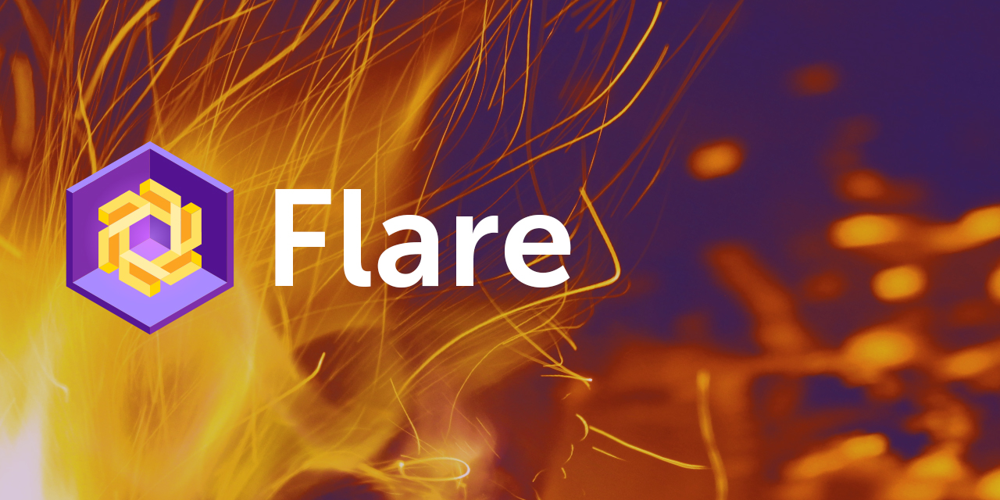

Welcome to flare
================

Web-App development framework for Python

About
-----

**flare** is an app development framework for Python-based web-apps
running on top of `Pyodide`_ in the browser.

It has integrations to concepts with `ViUR`_, an MVC-framework for the
Google App Engine platform, but can also be used stand-alone.

Fire up the tiny `Hello World`_ live demo.

.. _Pyodide: https://github.com/iodide-project/pyodide
.. _ViUR: https://www.viur.dev/
.. _Hello World: https://raw.githack.com/mausbrand/flare/master/hello.html

.. toctree::
   :maxdepth: 1
   :glob:
   :caption: Flare

   doc_start/index
   doc_guide/index
   doc_tutorial/index
   *

.. Indices and tables
   ==================

   * :ref:`genindex`
   * :ref:`modindex`
   * :ref:`search`